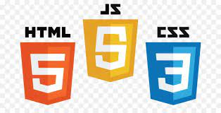

# zack-njenga-crypto-project
## PROJECT SUMMARY
What is the project about? Crypto Guess Game Challenge it is. 

## HOW TO PLAY
The game is launched using the start button. This initiates listing of properties of a random coin. The Player needs to guess the coin considering:
- Symbol
- Rank
- Current Price (USD)
- Market Cap
- First Letter
- Launch Year

With three chances, one is needed to guess the coin given three different sets of properties representing three different coins.

## TECHNOLOGIES
The web app has incorporated the following listed technologies:
- HTML
- CSS
- JavaScript

!

## HOW TO RUN THE APP LOCALLY
Running the app requires a setting up the provided API Endpoints locally:
```
https://api.coinpaprika.com/v1/coins
```
## LINKING TO THE LIVE GITHUB PAGES VERSION
Setting up the `gh-pages` branch locally then deploy it on github
